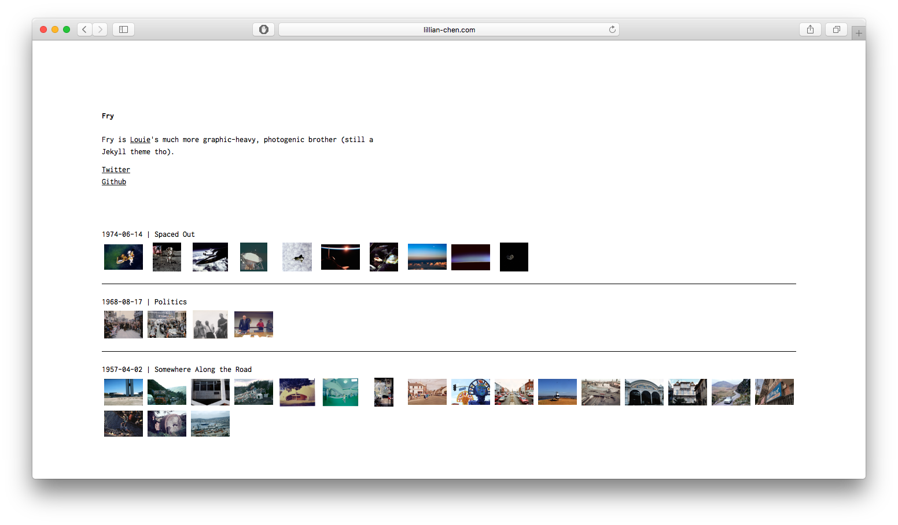
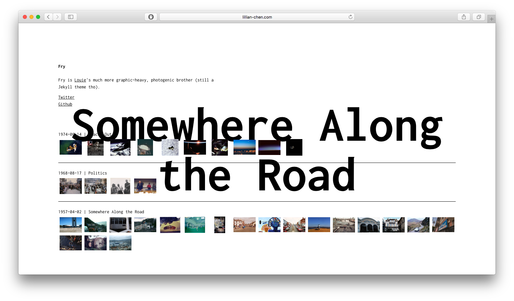
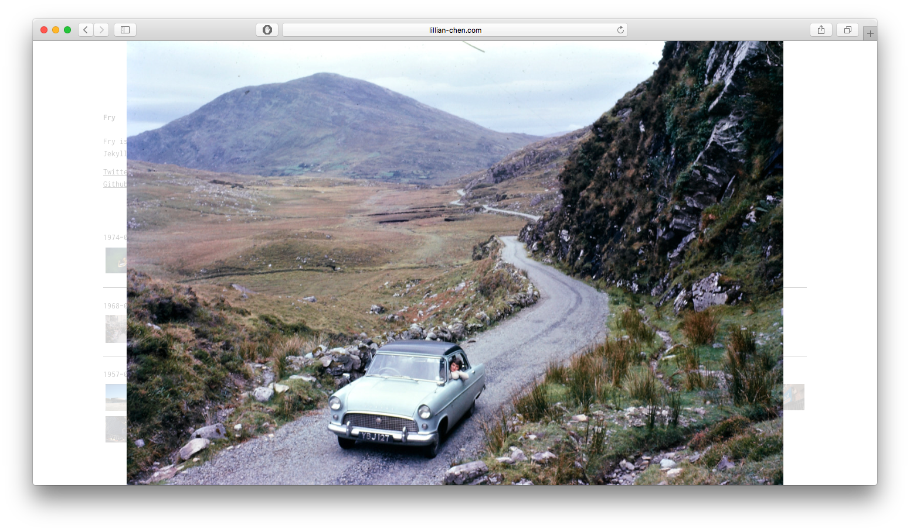

# Fry
=======
Fry is [Louie](https://github.com/lllychen/louie)'s much more graphic-heavy, photogenic brother (still a Jekyll theme tho).





## Installation
Add this line to your Jekyll site's Gemfile:

```ruby
gem "fry"
```

And add this line to your Jekyll site's `_config.yml`:

```yaml
theme: fry
```

And then execute:

    $ bundle

Or install it yourself as:

    $ gem install fry

## Usage
### Basic configurations
Here are a few general info fields to populate your new site right away.

```yaml
title: Fry
baseurl: "/fry"
favicon: "/assets/ico.png"
g_analytics: UA-12345678-1

header: name of your site here
desc: >
  description of your site, can be a quick bio if it's a portfolio. It supports HTML so add your links, imgs, whatever!
```

### Social media links
To add links to your social sites (linkedin, twitter, etc) below the bio, create a file named `social.yml` in your `_data` folder (which you may not have created yet). Inside it, follow the following format:

```yaml
- title: Twitter
  url: http://twitter.com/lllychen
- title: Github
  url: http://github.com/lllychen/fry
# and so on...
```

### Date format
The default format for dates is `%Y-%m-%d`, which displays January 2nd, 2017 as `2017-01-02`. However, you can customize it according to [this](http://jekyll.tips/jekyll-casts/date-formatting/#date) in `_config.yml` such as follows:

```yaml
date_format: "%Y-%m-%d"
```

### Photo sets
This site is organized by sets of photos, which are each essentially a Jekyll post. To add a new one, create a new post and in the front matter, follow the example below:

```yaml
layout: post
title: name of your project or the like
photos:
  unique-id-for-your-photo: path/to or url
```

The unique ID for each photo will be important as it is needed for the lightbox to work properly.

## License
The theme is available as open source under the terms of the [MIT License](http://opensource.org/licenses/MIT).

## Credit
Images collected by [New Old Stock](http://nos.twnsnd.co/)
